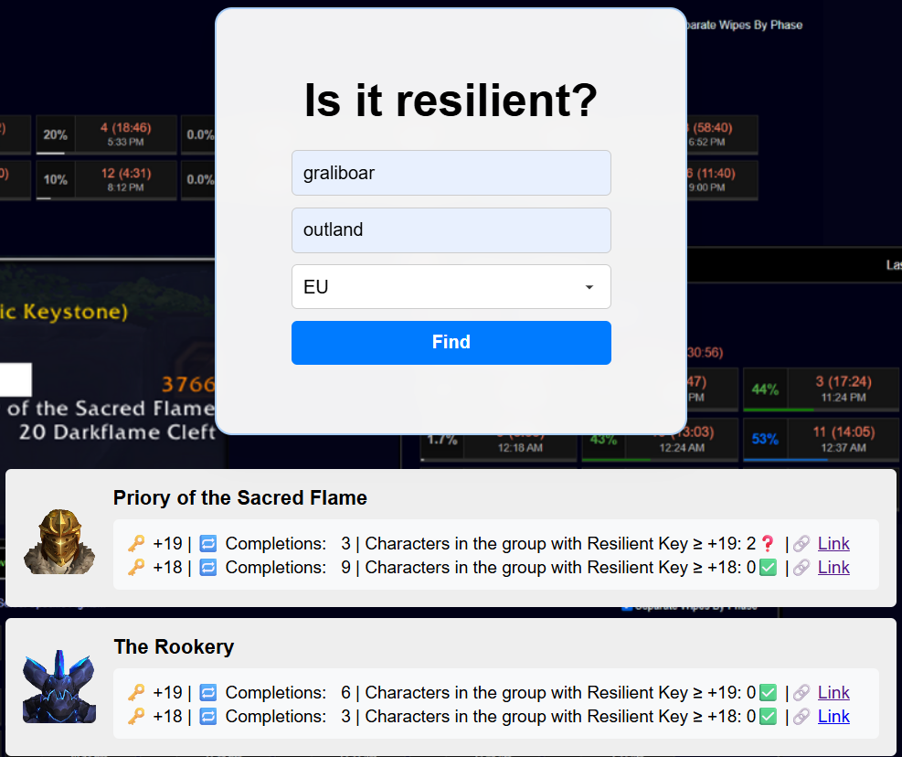

## **Is it resilient?**

This is a static web app that displays Mythic+ dungeon run reports based on data exported from [Raider.IO](https://raider.io) Timed Run Leaderboards for Season 2 of *The War Within* (TWW), covering both EU and NA regions. Only timed runs at keystone level 18 and above are included.

#### 📊 Data Summary
 - **Region**: EU | **Number of fetched runs**: 32686 | **Last Updated**: July 8, 2025
 - **Region**: NA | **Number of fetched runs**: 22127 | **Last Updated**: July 12, 2025

### 🔍 Features
 - Displays highest and second-highest key levels per dungeon for a specific character
 - Shows total number of completions at each of those levels
 - Provides a link to the first timed clear for each level
 - Counts how many party members had a resilient key at the same key level or higher at the time of the first clear (resilient key holders)

### 📸 Demo



In this screenshot, you can see part of the Mythic+ run report for [my character](https://raider.io/characters/eu/outland/Graliboar):
 - The table lists each dungeon with the highest and second-highest keystone levels completed
 - Next to each key level, the total number of completions is shown
 - The "**Characters in the group with Resilient Key**" shows how many party members had a resilient key of the same or higher level during that first clear

Here is my first [PSF 19 clear](https://raider.io/mythic-plus-runs/season-tww-2/18343656). In that run, two players in the group had a resilient 19 key (and in fact it was rogue's key).

### 📂 Data Format

The app loads data from JSON files, each corresponding to a database table exported from Raider.IO run data:
1. `<season>-<region>-character_dungeon_stats.json`

Summarizes Mythic+ completion stats per dungeon and key level for each character.
 - Example:
```json
[
  {
    "character_id": "Graliboar-Outland",
    "dungeon_name": "Operation: Floodgate",
    "difficulty_level": 18,
    "first_completed": "2025-05-11T17:12:41.000Z",
    "first_run_id": 14716061,
    "completion_count": 5
  },
  ...
]
```
2. `<season>-<region>-roster.json`
   
Lists characters included in the dataset.
 - Example:
```json
[
  {
    "run_id": 14716061,
    "character_ids": [
      "Rataucigasa-Silvermoon",
      "Миррко-Howling Fjord",
      "Graliboar-Outland",
      "Wolfmfer-Silvermoon",
      "Helblinde-Draenor"
    ]
  },
  ...
]
```

### 📝 Last Notes

**Q: Why store run data in JSON files? Why not use Blizzard or Raider.IO APIs?<br>**
**A:** There is no way (to my knowledge) to get a complete list of M+ runs for a character from either Blizzard or Raider.IO APIs. The data is stored locally in a database and then exported to JSON files for static querying.

**Q: Why are only keystone level 18+ runs included?<br>**
**A:** I believe this keystone range represents the most challenging and relevant content for players in the 0.1% Mythic+ title range, who are likely the main users of this app. It also limits the number of runs I have to store to a reasonable number.

**Q: Any plans to make this available for Season 3 of TWW?<br>**
**A:** Most likely.
