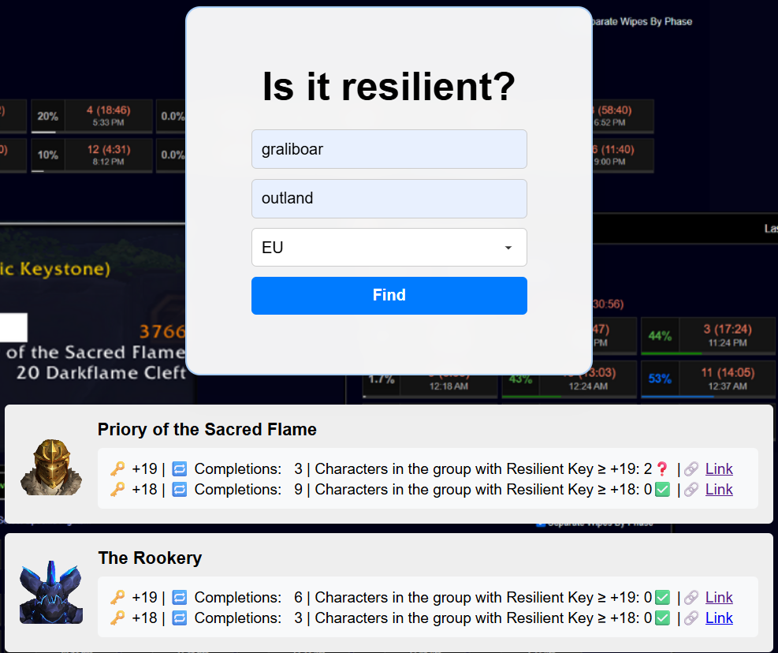

## **Is it resilient?**

This is a static web app that displays Mythic+ dungeon run reports based on data exported from [Raider.IO](https://raider.io) Timed Run Leaderboards for Season 2 and 3 of *The War Within* (TWW), and Season 1 of *Midnight* (MN) covering both EU and NA regions.

#### 📊 Data Summary
##### TWW Season 2
 - **Region**: EU | **Number of fetched runs**: 42463 | **Last Updated**: August 7, 2025
 - **Region**: NA | **Number of fetched runs**: 28457 | **Last Updated**: August 7, 2025
##### TWW Season 3
 - **Region**: EU | **Number of fetched runs**: 73370 | **Last Updated**: January 21, 2026
 - **Region**: NA | **Number of fetched runs**: 41748 | **Last Updated**: January 21, 2026
##### MN Season 1
 - **Region**: EU | **Number of fetched runs**: 110218 | **Last Updated**: May 19, 2026
 - **Region**: NA | **Number of fetched runs**: 52208 | **Last Updated**: May 19, 2026

### 🔍 Features
 - Displays highest and second-highest key levels per dungeon for a specific character
 - Shows total number of completions at each of those levels
 - Provides a link to the first timed clear for each level
 - Counts how many party members had a resilient key at the same key level or higher at the time of the first clear (resilient key holders)

### 📸 Demo



In this screenshot, you can see part of the Mythic+ run report for [my character](https://raider.io/characters/eu/outland/Graliboar):
 - The table lists each dungeon with the highest and second-highest keystone levels completed
 - Next to each key level, the total number of completions is shown
 - The "**Characters in the group with Resilient Key**" shows how many party members had a resilient key of the same or higher level during that first clear

Here is my first [PSF 19 clear](https://raider.io/mythic-plus-runs/season-tww-2/18343656). In that run, two players in the group had a resilient 19 key (and in fact it was rogue's key).

### 📂 Data Format

The app loads data from JSON files, each corresponding to a database table exported from Raider.IO run data:
1. `<season>-<region>-character_dungeon_stats.json`

Summarizes Mythic+ completion stats per dungeon and key level for each character.
 - Example:
```json
[
  {
    "character_id": "Graliboar-Outland",
    "dungeon_name": "Operation: Floodgate",
    "difficulty_level": 18,
    "first_completed": "2025-05-11T17:12:41.000Z",
    "first_run_id": 14716061,
    "completion_count": 5
  },
  ...
]
```
2. `<season>-<region>-roster.json`
   
Lists characters included in the dataset.
 - Example:
```json
[
  {
    "run_id": 14716061,
    "character_ids": [
      "Rataucigasa-Silvermoon",
      "Миррко-Howling Fjord",
      "Graliboar-Outland",
      "Wolfmfer-Silvermoon",
      "Helblinde-Draenor"
    ]
  },
  ...
]
```
